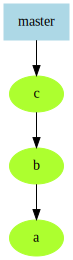
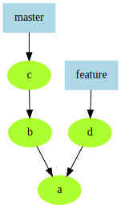
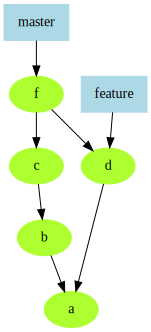
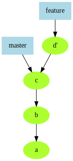
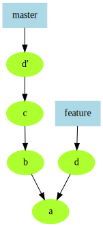

Branching and Merging
=====================

Visualizing history
-------------------

::::::::: {.columns}
::: {.column width="30%"}

:::
::: {.column width="70%" .textcolumn}
    git log --graph --oneline

    * 5567e85 (HEAD -> master) My third git commit
    * df5a1e0 My second git commit
    * d3a1a32 My first git commit
:::
:::::::::

Branching off
-------------

::::::::: {.columns}
::: {.column width="30%"}

:::
::: {.column width="70%" .textcolumn}
    git branch feature master~2
    git checkout feature
    $EDITOR; git commit -a

    * 16ae900 (feature) Commit on feature branch
    | * 5567e85 (master) My third git commit
    | * df5a1e0 My second git commit
    |/
    * d3a1a32 My first git commit
:::
:::::::::

Merging
-------

::::::::: {.columns}
::: {.column width="30%"}

:::
::: {.column width="70%" .textcolumn}
    git checkout master
    git merge feature
:::
:::::::::

Merge conflicts
---------------

Git merges histories of the entire repository; until _all_ conflicts are
resolved and committed, the merge is "in progress" for all files.

<ul class="hints">
<li>You can abort a merge in progress with `git merge --abort`</li>
</ul>

Rebasing
--------

::::::::: {.columns}
::: {.column width="30%"}

:::
::: {.column width="70%" .textcolumn}
    git checkout feature
    git rebase master
:::
:::::::::

Cherry-picking
--------------

::::::::: {.columns}
::: {.column width="30%"}

:::
::: {.column width="70%" .textcolumn}
    git checkout master
    git cherry-pick feature
:::
:::::::::

Merge/Rebase/Cherry-pick
-------------------------

::::::::: {.columns}
::: {.column width="25%"}

:::
::: {.column width="25%"}

:::
::: {.column width="25%"}

:::
::: {.column width="25%"}

:::
:::::::::
